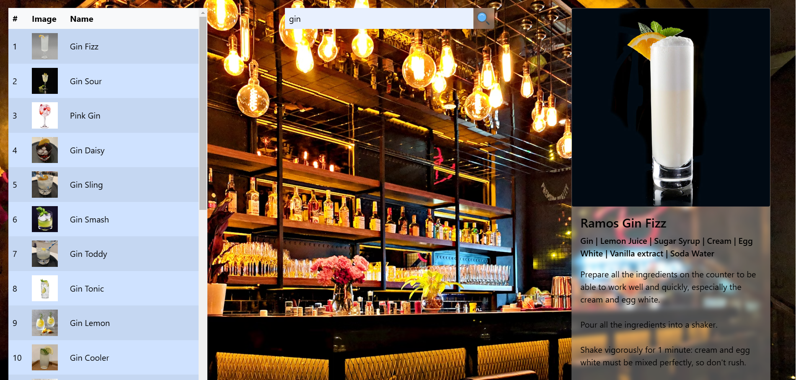

# TheCocktail

TheCocktail is a web app that allows users to search for cocktail recipes, view drink images, and get detailed preparation instructions. This project utilizes TheCocktailDB API to fetch real-time cocktail data.

**Link to project:** [TheCocktail App](https://the-cocktail-app-cs9z.onrender.com)

## How It's Made:

**Tech used:** HTML, CSS, JavaScript, Bootstrap, TheCocktailDB API

The project is built with vanilla JavaScript and Bootstrap for styling. The app fetches data dynamically from TheCocktailDB API based on user input. It displays a searchable list of cocktails, showing images, ingredients, and instructions for each drink. The design is visually appealing, featuring a modern UI with a stylish background image.

## Optimizations (Planned Future Improvements):

- **Better CSS Styling**: Plan to refine CSS for improved UI, including better transparency and enhanced readability.
- **Improved Mobile Responsiveness**: Optimize the layout to ensure a seamless experience on all screen sizes.
- **Search Performance Enhancements**: Implement debouncing in the search functionality to minimize API calls and improve efficiency.
- **Accessibility Improvements**: Enhance keyboard navigation and ARIA attributes for a more accessible app.

## Lessons Learned:

- Gained hands-on experience working with an external API and dynamically displaying data.
- Learned advanced CSS techniques for better transparency and UI/UX improvements.
- Understood the importance of optimizing JavaScript event listeners to enhance performance.
